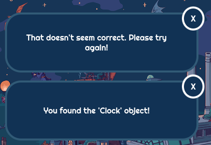
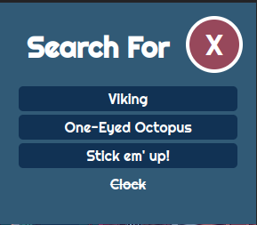
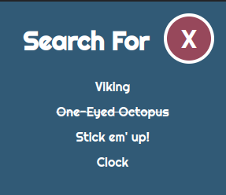
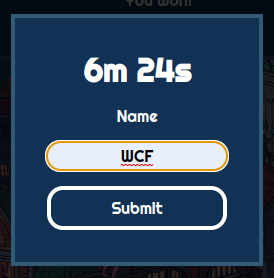
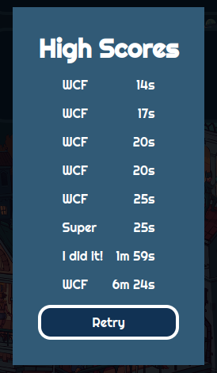

- [odin-waldo](#odin-waldo)
  - [Screenshots](#screenshots)
    - [Main Site](#main-site)
    - [Object Selection](#object-selection)
    - [Notifications](#notifications)
    - [Pop Out Menu](#pop-out-menu)
    - [High Score Submission](#high-score-submission)
    - [High Score Display](#high-score-display)
  - [Installation](#installation)
    - [Retrieve this project](#retrieve-this-project)
    - [Install the required packages](#install-the-required-packages)
    - [Create a firebase project](#create-a-firebase-project)
    - [Configure](#configure)
    - [Build the project for Local Hosting](#build-the-project-for-local-hosting)
    - [Build the project for Web Server](#build-the-project-for-web-server)
      - [Host on a server](#host-on-a-server)
  - [TODO](#todo)

# odin-waldo

A "Hidden Object" searching game, similar to "Where's Waldo"

## Screenshots

### Main Site


The application as it is presented to the user on first visit.

### Object Selection


When clicking on the image, the user is given a bright crosshair to indicate which area is being targeted. A pop out menu is animated onto the screen, allowing the user to pick which object they have found.

### Notifications



The user can click on the text or the 'close' button to dismiss notifications. I made the decision to not auto-dismiss the notifications intentionally. To enable that functionality, set `autoClose` to `true` in `src/components/Message.js`.

### Pop Out Menu




The pop out can be activated by clicking on the "Object Counter" button in the upper right of the screen, or by placing the crosshair by clicking on the image. If no crosshair is placed, the selection button becomes a text container to indicate that selection is currently not possible.

### High Score Submission



When you complete the game, a modal pops up and allows the user to type their name for immortalize their accomplishment, until I clear the data.

### High Score Display



This is what the High Score display looks like, and is displayed after entering your name and will display the "top 10" scores.

## Installation

### Retrieve this project

Download this project using your preferred method. For example:

```bash
git clone https://github.com/waynefuchs/odin-waldo.git
```

### Install the required packages

```bash
cd odin-waldo
npm install
```

### Create a firebase project

Visit the [Firebase Console](https://console.firebase.google.com/), Add a project with Firestore Database. Under **Project Settings**, get your firebaseConfig and update `src/firebase.js`.

Security configuration of this database is outside the scope of this README.

### Configure

Edit the package.json, and change the `homepage` value to `/`, or another path value that is required in your use case. I have it configured for the target folder on my server.

### Build the project for Local Hosting

```bash
npm run start
```

### Build the project for Web Server

#### Host on a server

```bash
npm run build
```

This creates a `build` directory with the finished project in it. Upload this to a live webserver.

## TODO

- Remove unused components
- Solve useEffect linting error
- Take new screenshots
- Write a bit of description here
- Give the artist credit here
